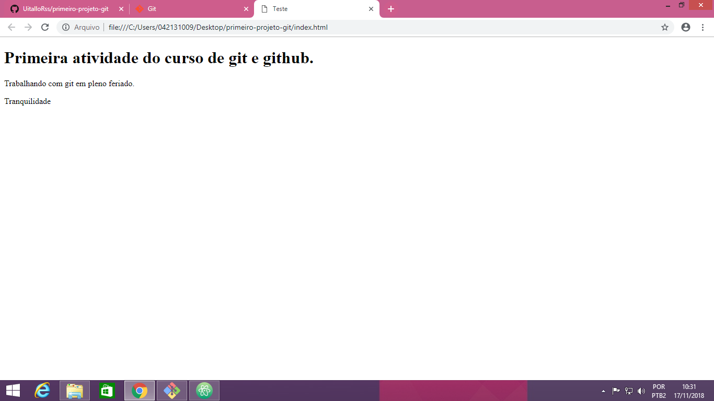

# Primeira atividade do curso de git e github.

Atividade realizada no dia 17/11/2018 na UNIFACS Paralela.

  - Desenvolvedor: Uítalo Souza
  - Instrutor: Victor Romário

  ### Descrição:
  > Página simples em HTML, com o objetivo de exemplificar a alteração, criação e submissão de um projeto ao GITHUB, com o GIT.

  Tecnologias utilizadas no projeto:
  * html
  * [GIT](https://git-scm.com/)
  * Markdown

  ### Comandos do GIT aprendidos até aqui:
  ```sh
$ git config --global user.name "seu nome"
$ git config --global user.email seuemail
  ```
Após a criação do projeto no computador:
```sh
$ cd Desktop/primeiro-projeto-github
$ git init
$ git status
$ git add
$ git commit -m "mensagem"
$ git log
```
Submissão para o GITHUB:
```sh
$ git remote add origin enderecoHTTPSdoRepositorio
$ git push -u origin master
```
### Imagem da Página

